# PHP原生代码实现的商城

> 比较简陋,学校的作业
## 功能描述
### 前台
- 注册、登录
- 用户中心、编辑资料、上传头像
- 购物车
- 显示广告轮播、公告文章、商品
- 搜索
  
### 后台
  - 商品增删改查
  - 文章增删改查
  - 广告增删改查
  - 用户增删改查

## 系统截图
### 前台
#### 首页
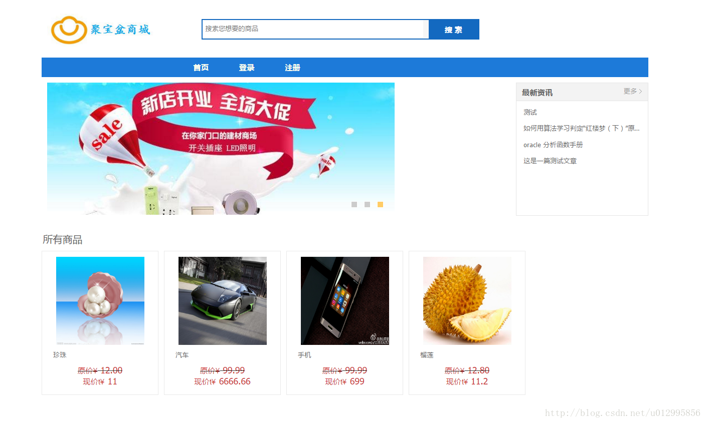

#### 登录
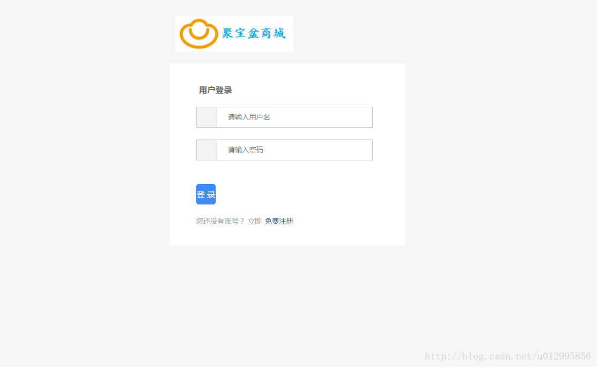

#### 注册
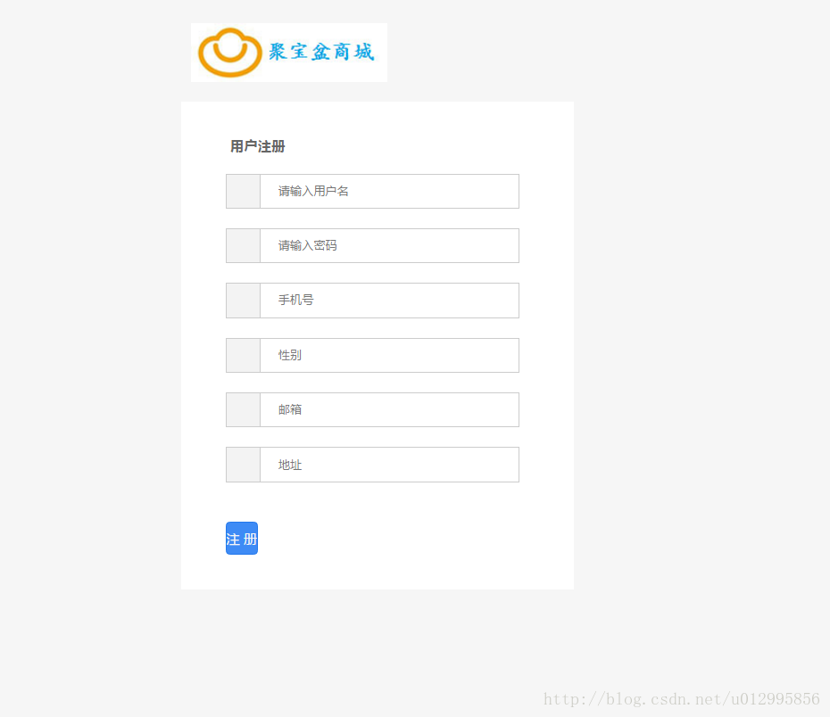

#### 用户中心
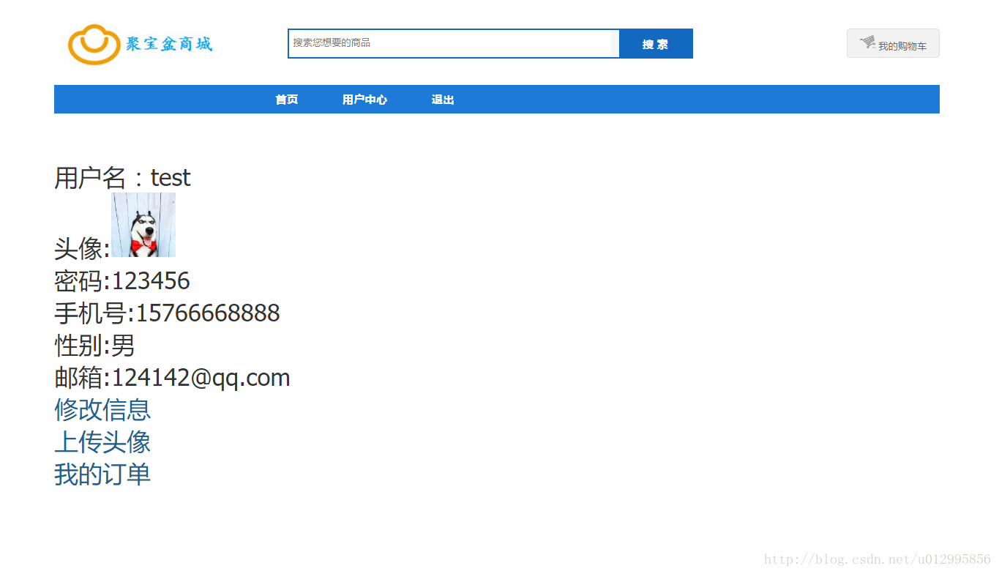

#### 修改信息
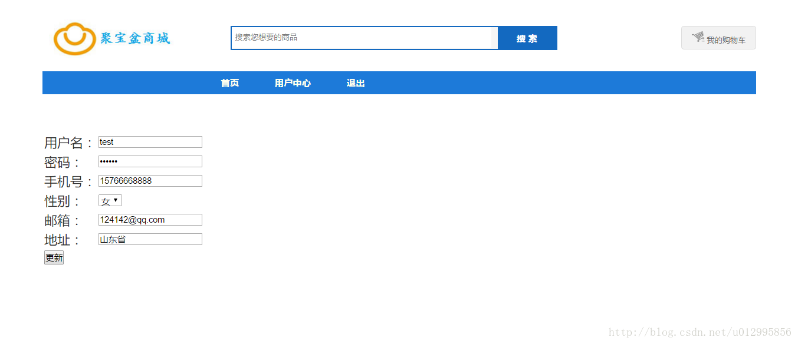

#### 上传头像
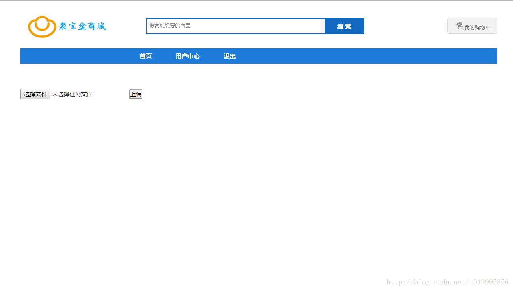

#### 我的订单
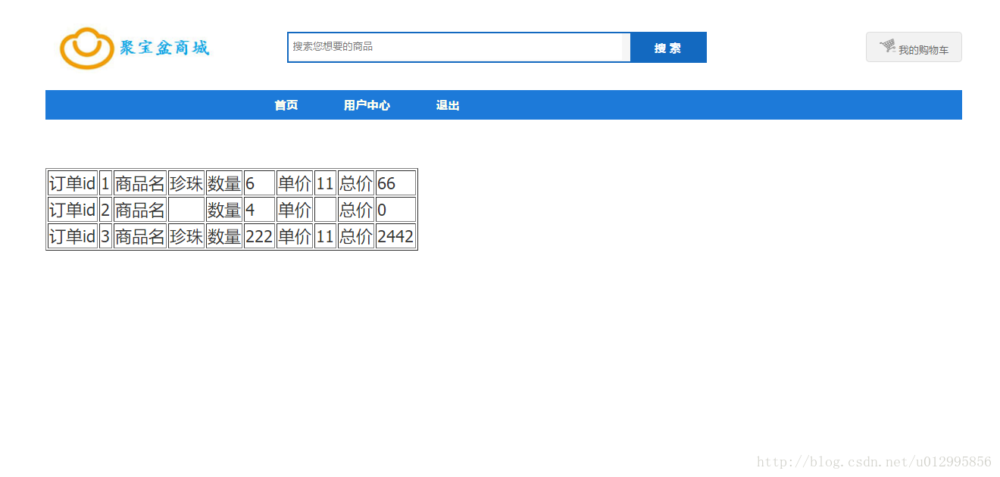

#### 购物车
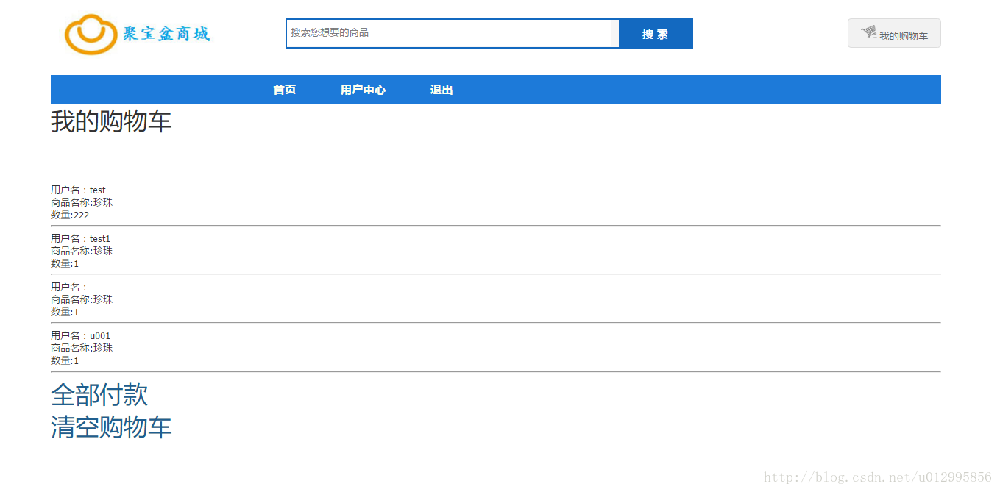

#### 新闻
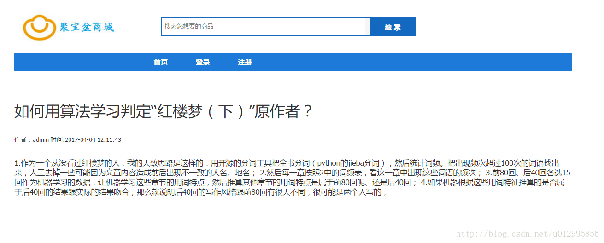

### 后台
#### 商品列表
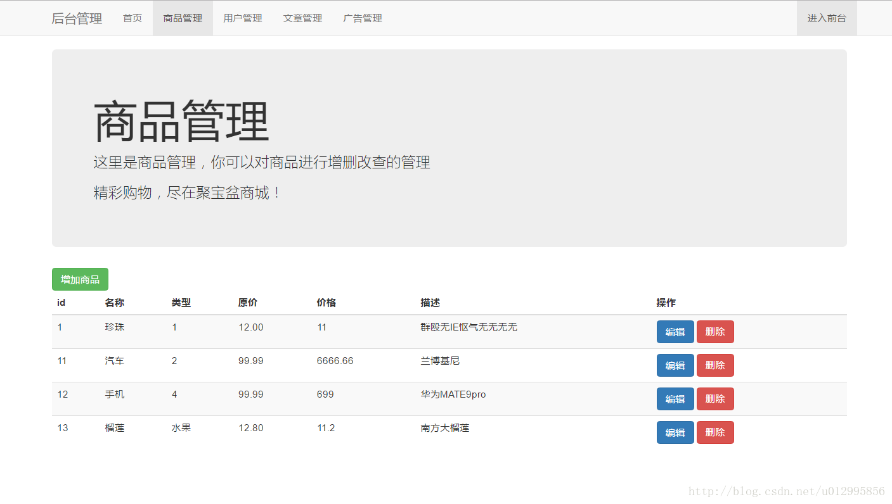

#### 添加商品
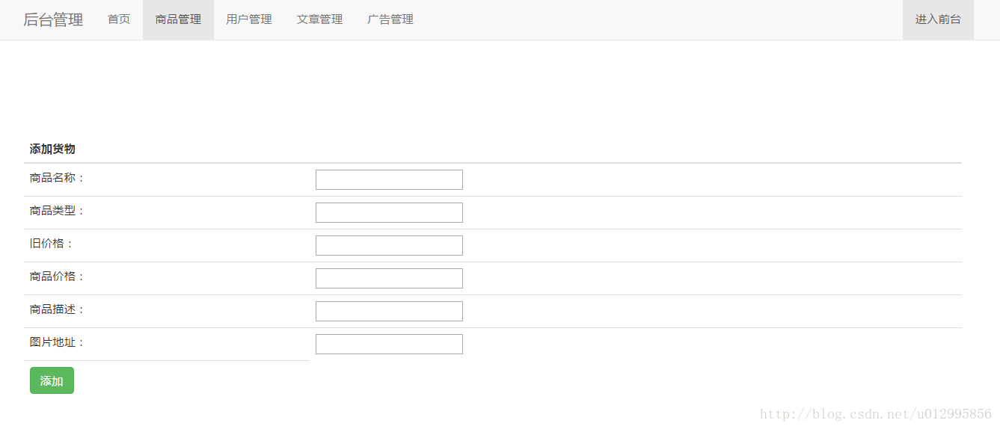

#### 编辑商品
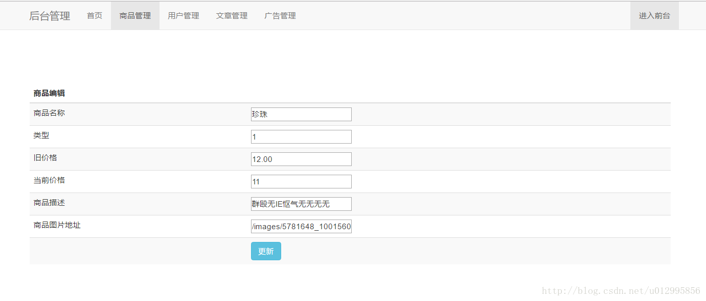

#### 用户列表
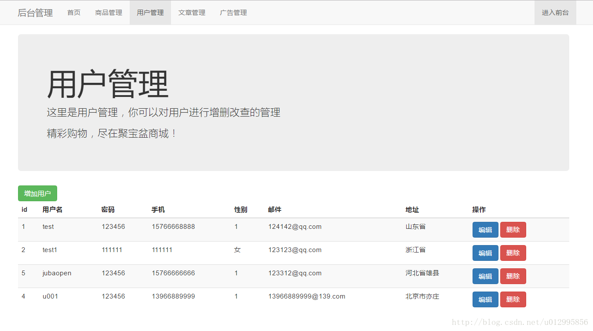

#### 文章列表
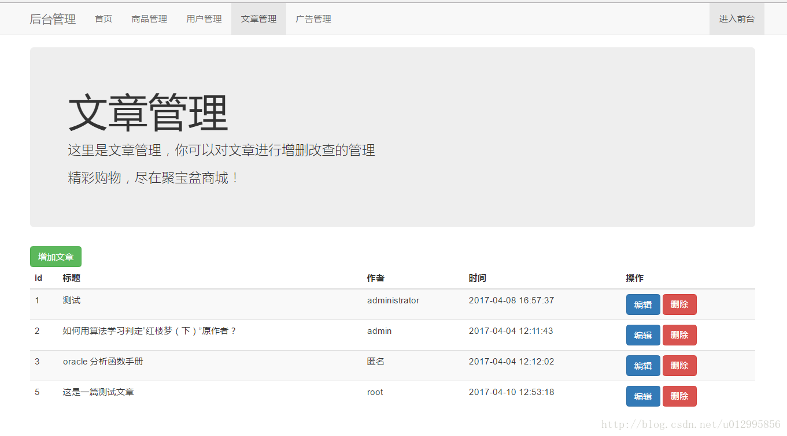

#### 广告列表
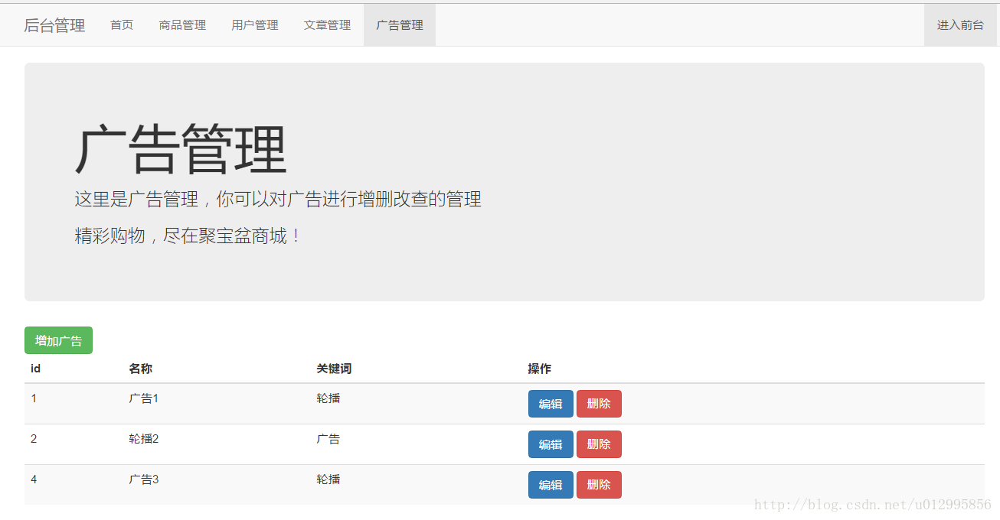
